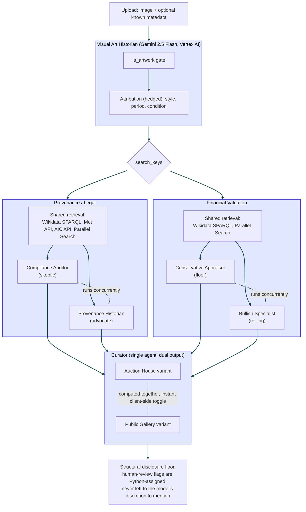

# Artgents

**A multi-agent fine art provenance, valuation, and curation studio.**

Upload a photo of a physical artwork — a painting, a sculpture, anything
without an existing catalog entry — and Artgents runs it through four
AI agents that research it the way a real gallery or auction house
team would: a visual analyst identifies style and period, two
adversarial sub-agents debate its provenance risk, two more debate its
market value, and a curator writes publication-ready exhibition copy
from everyone's findings.

Built for the **Ready, Spec, Ship** hackathon using [Kiro](https://kiro.dev).

---

## The problem

Galleries and auction houses spend hundreds of hours per piece on
manual work: tracing ownership history, checking for undocumented gaps
or theft records, estimating a defensible price range, and writing
exhibition copy — all before a piece can go on a wall or under the
hammer. Most of this research follows the same pattern regardless of
the artwork: look at the piece, research its history, estimate its
value, write it up.

## What makes this different from "wrap a prompt around GPT"

Real due diligence isn't a single verdict — it's a debate. A title
attorney and a provenance historian read the same ownership gap
differently. A conservative appraiser and a bullish specialist read
the same auction comps differently. Artgents makes that debate
**visible**, not hidden behind a single averaged-out answer:

- **Provenance/Legal** runs a **Compliance Auditor** (skeptic) and a
  **Provenance Historian** (contextualizer) concurrently over the
  *same* retrieved evidence, and shows both verdicts side by side —
  including when they disagree.
- **Financial Valuation** runs a **Conservative Appraiser** (floor)
  and a **Bullish Specialist** (ceiling) the same way, producing a
  real valuation corridor instead of a single fabricated number.
- **Curator** synthesizes everything into two distinct voices —
  Auction House catalog copy or Public Gallery wall-label copy — with
  a structurally-guaranteed disclosure floor: if either dual-agent
  stage flags something requiring human review, that fact **cannot**
  be silently dropped from the final copy, regardless of how the
  narrative reads.

Every factual claim in the app — every ownership record, every
comparable sale — carries a real, clickable source URL. Nothing is
asserted without a citation a judge can independently verify.

---

## Architecture



Provenance/Legal and Financial Valuation run **concurrently**
(`asyncio.gather`), not sequentially — the loading UI visualizes this
directly, showing real wall-clock time for the concurrent stage
alongside each individual agent's own duration.

---

## Usage for Judges
 
1. Open the deployed app (or `npm run dev` locally — see
   [Local development](#local-development)).
2. Upload one or more photos of a physical artwork (drag-and-drop or
   click to browse).
  
   *Test image used during development:*
   [Adoration of the Magi, The Met](https://images.metmuseum.org/CRDImages/rl/web-large/DP-25504-001.jpg)
3. Optionally fill in any known metadata — title, artist, period,
   medium — if you have it. Leave any field blank if you don't; the
   system is designed to work from the image alone.
4. Click **Analyze Artwork**. A real analysis takes **60-90+ seconds**
   — the loading view shows real, live substep progress (not a fake
   timer) as each agent actually completes its work, including the
   concurrent stage's genuine wall-clock time.
5. On the results page:
   - Read the attribution, style, and condition analysis.
   - Compare the **Compliance Auditor** and **Provenance Historian**
     cards side by side — a warning banner appears if they genuinely
     disagree, or if neither can determine a risk level from the
     available evidence.
   - Compare the **Conservative Appraiser** and **Bullish Specialist**
     cards, and the resulting valuation corridor.
   - Toggle between **Auction House** and **Public Gallery** copy —
     both are already computed, so this is instant.
   - Click any evidence source link to verify the underlying claim
     independently — every citation is a real, working URL.
   - Hover over underlined technical terms for a plain-language
     definition.
6. A `/demo` route is also available, showing a guided walkthrough of
   a real, pre-captured result with narrated explanation of each
   agent's role — useful if you want to see the architecture explained
   without waiting on a live run.
---

## Tech stack

| Layer | Technology |
|---|---|
| Backend | Python 3.12, FastAPI, `uv` |
| Models | Gemini 2.5 Flash via **Vertex AI** (not the AI Studio free tier — see [Cost & rate limits](#cost--rate-limits)) |
| Open web retrieval | [Parallel Search API](https://parallel.ai) |
| Structured open data | Wikidata SPARQL, The Met Open Access API, Art Institute of Chicago API |
| Frontend | React, Vite, TypeScript, Tailwind |
| Backend deploy | Google Cloud Run |
| Frontend deploy | Vercel |

---

## Built with Kiro

This project was built end-to-end using Kiro's spec-driven workflow.
Every agent, the pipeline orchestration layer, the API, and the
frontend each have their own requirements -> design -> tasks spec trio
in [`.kiro/specs/`](./.kiro/specs/), and project-wide conventions live
in [`.kiro/steering/`](./.kiro/steering/).

A few examples of what that trail actually looks like:

- **`.kiro/steering/structure.md`** documents real, hard-won
  conventions discovered during the build — e.g. the "Reuse over
  re-run" principle (don't re-run upstream pipeline stages just to
  satisfy a parameter that only affects the last stage), and the
  shared dual-agent retrieval-then-reasoning architecture used by
  both Provenance/Legal and Financial Valuation.
- **Each agent's spec evolved through real bugs found in testing, not
  just written once.** For example, `.kiro/specs/provenance_legal/`
  went through several iterations after real testing surfaced a
  cross-object evidence contamination bug (facts about multiple
  different artworks by the same prolific artist getting merged into
  one false narrative) — the fix (`evidence_scope` +
  `source_entity_id` tracking) is documented in the spec and was then
  proactively built into Financial Valuation's spec from day one,
  rather than being rediscovered there too.
- Kiro was directed to **flag disagreements between its own
  requirements and design docs back to the requester rather than
  silently resolving them**, and to check real, current code before
  building on top of assumptions — several follow-up prompts exist
  specifically because Kiro correctly reported a spec/implementation
  mismatch rather than guessing.

## Real, open data — nothing simulated

Every data source this app queries is genuinely public and free:

- **Wikidata** (SPARQL endpoint, no auth) — ownership history,
  significant events (including documented Nazi-plunder tags),
  sale-price properties.
- **The Met Open Access API** and **Art Institute of Chicago API** —
  museum provenance records, no auth required.
- **Parallel Search API** — public auction press coverage, news
  articles, theft/plunder registries.

No paywalled data source (Art Loss Register, Artnet Price Database,
Sotheby's/Christie's internal ledgers) is used or pretended to be used.
Where a claim can't be backed by one of the sources above, the agents
are explicitly instructed to say so — see the confidence-calibration
and evidence-scoping behavior below.

## What this app is *not*

- **Not an authentication service.** It does not certify a work is
  genuine — Visual Art Historian describes stylistic consistency and
  explicitly hedges named-artist attribution unless a signature is
  legible.
- **Not a formal title/theft check.** The Art Loss Register and
  Interpol's stolen art database are paywalled/access-restricted;
  Provenance/Legal surfaces documented, *publicly retrievable* red
  flags instead, and says so.
- **Not a certified appraisal.** Financial Valuation produces a
  heuristic corridor from public comparable sales, explicitly labeled
  as such throughout the UI — never presented as a definitive
  appraisal.

---

## Cost & rate limits

- **Vertex AI (Gemini 2.5 Flash):** billed against Google Cloud
  credit, not the free AI Studio tier (which has a 5-15 requests/min
  ceiling too low for this app's concurrent multi-agent calls). The
  deployed app is funded for the judging window — **no payment or API
  key is required to test it.**
- **Parallel Search:** credit-based pricing; the account funding this
  deployment has promotional credit sufficient for the judging window.
- **Wikidata, Met, AIC:** free, public, no auth, no rate-limit
  concerns at this scale. 429 errors are gracefully handled.

## Known limitations (explicit scope decisions, not oversights)

- **Single Cloud Run instance, by design.** The job-status store and
  local response cache are both in-memory/local-filesystem, which
  only works correctly with exactly one backend instance —
  `--min-instances=1 --max-instances=1` is a correctness requirement
  for this deployment, not a cost-saving default. See
  `.kiro/specs/deployment/requirements.md`.
- **Response cache does not survive a redeploy or restart** — it's a
  local file cache scoped to a single running container, useful within
  a session but not a persistent store.
- **No real-time streaming.** Progress polling reports genuine
  substep completion (not a fake timer), but each poll is a normal
  HTTP request/response, not a live socket.

---

## Local development

```bash
# Backend
uv sync
uv run uvicorn artgents.api.app:app --reload --port 8080

# Frontend (separate terminal)
cd frontend
npm install
npm run dev
```

Set `VITE_API_URL` in `frontend/.env.local` to point at your local
backend (`http://localhost:8080`) or the deployed Cloud Run URL.

Backend environment variables needed: `GOOGLE_APPLICATION_CREDENTIALS`, 
`GCP_PROJECT`, `GCP_LOCATION`, `PARALLEL_WEB_API_KEY`. 
See [`DEPLOYMENT.md`](./DEPLOYMENT.md) for the full deployment walkthrough.

## Testing

```bash
# Backend -- full suite
uv run pytest

# Backend -- skip the manual/live-API integration tests
uv run pytest -m "not integration"

# Frontend
cd frontend
npm test
```

Integration tests that call real external APIs (Vertex, Wikidata,
Parallel Search, Met, AIC) are marked separately and are not part of
the default test run — see each agent's spec under `.kiro/specs/` for
the "Testing approach" section explaining why.

---

## Live demo

- **App:** [Artgents](https://artgents.vercel.app/)
- **API health check:** [health-check](https://artgents-backend-305902429216.us-central1.run.app/api/health)
- **Demo video:** [Artgents-Demo](https://youtu.be/jIQe7OgtrzM)

---

## Attribution
 
**AI platform**
- [Kiro](https://kiro.dev) — spec-driven development tool used to
  build this entire project (see [Built with Kiro](#built-with-kiro)).
- [Google Gemini 2.5 Flash](https://ai.google.dev/) via
  [Vertex AI](https://cloud.google.com/vertex-ai) — all four agents'
  reasoning, and the demo narration's text-to-speech generation.

**APIs and data sources**
- [Wikidata](https://www.wikidata.org/) — ownership history and
  sale-price data, queried via its public SPARQL endpoint. Wikidata
  content is available under the [Creative Commons CC0
  license](https://creativecommons.org/publicdomain/zero/1.0/).
- [The Metropolitan Museum of Art Open Access
  API](https://metmuseum.github.io/) — museum provenance records.
  Met Open Access data is released under
  [CC0](https://www.metmuseum.org/about-the-met/policies-and-documents/open-access).
- [Art Institute of Chicago API](https://api.artic.edu/docs/) —
  museum provenance records, released under
  [CC0](https://www.artic.edu/open-access).
- [Parallel Search API](https://parallel.ai) — open web retrieval for
  auction press coverage and public theft/plunder registries.

**Backend frameworks and libraries**
- [FastAPI](https://fastapi.tiangolo.com/), [Pydantic](https://docs.pydantic.dev/),
  [uv](https://docs.astral.sh/uv/), [httpx](https://www.python-httpx.org/),
  [loguru](https://github.com/Delgan/loguru), [uvicorn](https://www.uvicorn.org/) —
  all open-source, used under their respective licenses (MIT/Apache
  2.0 as applicable to each project).

**Frontend frameworks and libraries**
- [React](https://react.dev/), [Vite](https://vite.dev/),
  [TypeScript](https://www.typescriptlang.org/),
  [Tailwind CSS](https://tailwindcss.com/),
  [react-router](https://reactrouter.com/) — all open-source, used
  under their respective licenses (MIT as applicable to each project).

**Deployment**
- [Google Cloud Run](https://cloud.google.com/run) (backend),
  [Vercel](https://vercel.com/) (frontend).

No proprietary, paywalled, or restricted-access data source is used
anywhere in this project — see [Real, open data — nothing
simulated](#real-open-data--nothing-simulated).